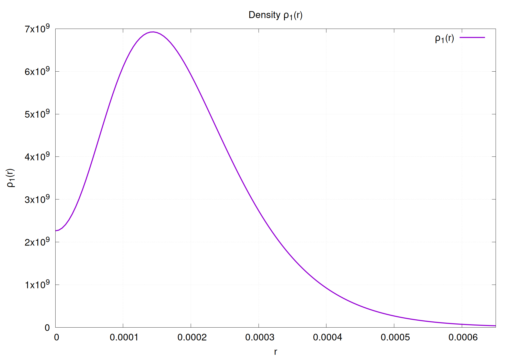
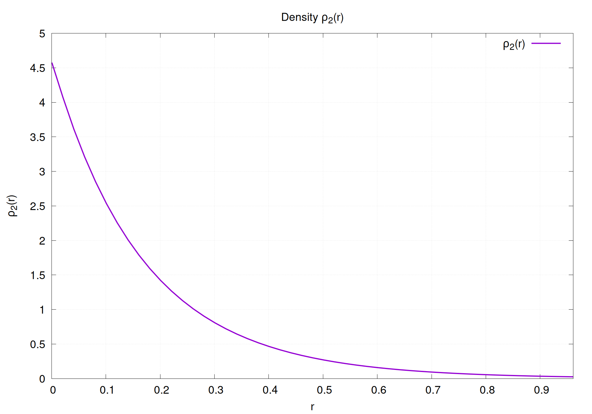
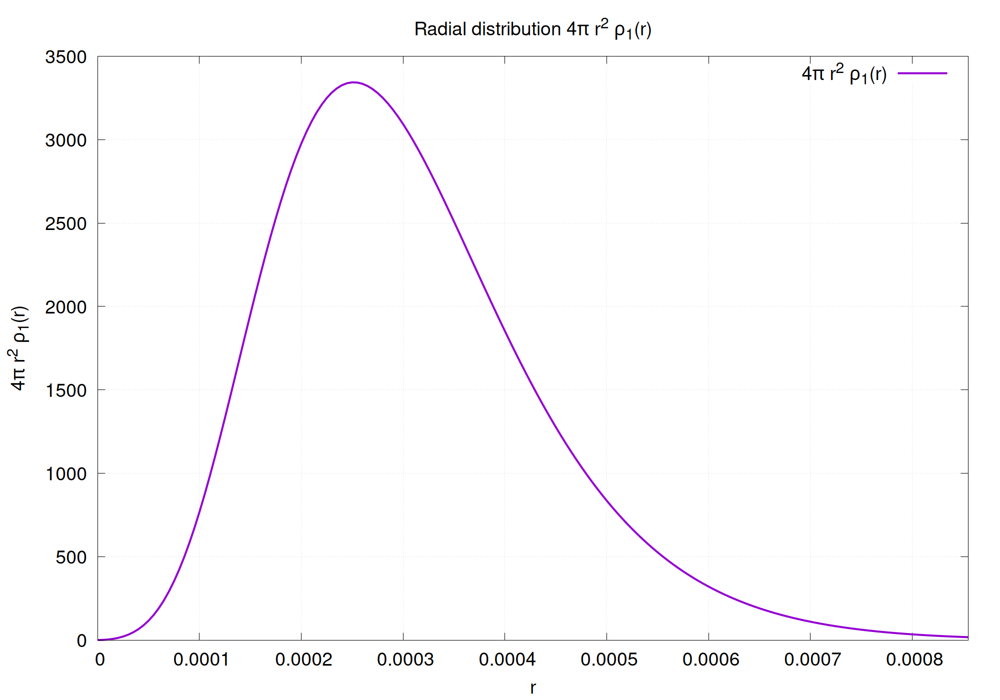
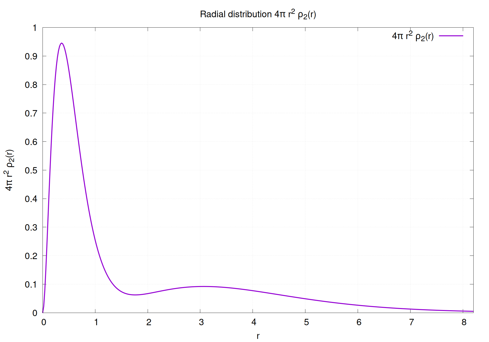
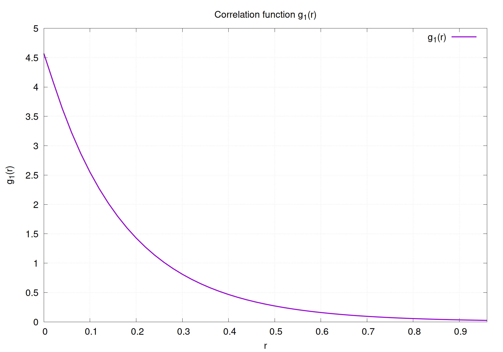
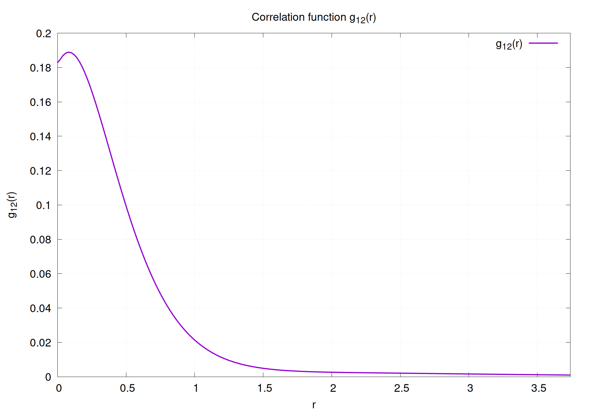
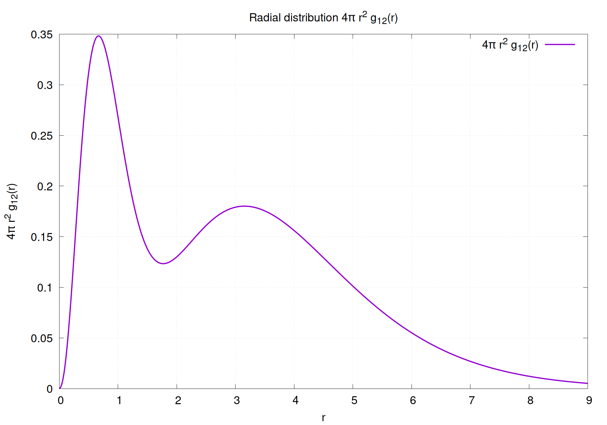

# Description

Sample file `inout.txt` in this directory contains a basis of 100 ECG functions for the ground state of Li atom (lowest $^2 S^e$ state of Li-7 isotope) and sets up calculations of particle distributions in the coordinate space: particle densities in the center-of-mass frame, $\rho_i(r)$ , and pair correlation functions, $g_{i}(r)$ and $g_{ij}(r)$ . Expectation values of various operators are also computed in one go.
The calculations should take roughly 2-3 seconds on a single CPU core when double precision is used (gfortran compiler / AMD Ryzen AI 9 HX 370).

The instruction that is used in `inout.txt` to run calculations of distributions has the following format:  
`DENSITIES I 100 cf_grid.dat cf.dat dens_grid.dat dens.dat`  
Here `cf_grid.dat` and `dens_grid.dat` are files that contain the 1D grids where the correlation functions and densities need to be computed. In principle, the grids for both the correlation functions and densities could come from the same file (e.g. `grid.dat`) if the expected range of all distributions is comparable. The grids do not need to be uniform. The points do not have to be sorted in increasing order.

For atomic systems with a finite-mass nucleus, such as Li, the density of the first particle (nucleus) is expected to be highly localized around the origin (center of mass), $r=0$. In other words, the effective range of the nuclear distribution is about 3 orders of magnitude shorter than that for electrons. If both the electronic and nuclear densities are needed then the calculations can be arranged in two ways:  

* Two independent calculations with two different `dens_grid.dat` files.
* A single calculation with a grid that has finer step size around the origin and the coarser step size at larger distances.  

In this example the second approach is adopted. Files containing some relevant grids `cf_grid.dat` and `dens_grid.dat` are provided in the same directory as `inout.txt`. When the calculations are executed they also must be in the same directory where the `inout.txt` is located and where the program runs.

A Bash script `create_grid.bash` is also provided for convenience. One can adjust grid parameters in this script. When executed it creates files `cf_grid.dat` and `dens_grid.dat`.

After correlation functions and densities have been calculated, files `cf.dat` and `dens.dat` are created in the execution directory. They have the following format:

```
          #r                      g1                      g12
  0.0000000000000000E+00  0.4569780643627733E+01  0.1828216639187345E+00
  0.2000000000000000E-01  0.4092345825398628E+01  0.1847144292074289E+00
  0.4000000000000000E-01  0.3632177096641532E+01  0.1869899592721863E+00
  0.6000000000000000E-01  0.3225843985083822E+01  0.1883482062987181E+00
  ...
  ...
  ...
```

```
          #r                      rho1                    rho2
  0.0000000000000000E+00  0.2262612669116426E+10  0.4570127870025772E+01
  0.5000000000000000E-05  0.2278991046213717E+10  0.4570127721677911E+01
  0.1000000000000000E-04  0.2327861986406901E+10  0.4570127276636882E+01
  0.1500000000000000E-04  0.2408437907600881E+10  0.4570126534904735E+01
  ...
  ...
  ...
```

Note that if there are identical particles in the system (e.g. three electrons in Li atom), the number of $\rho_{i}$ distributions written in the `dens.dat` file is less than the number of particles. In the case of Li atom $\rho_1(r)$ is the nuclear density, while $\rho_2(r)=\rho_3(r)=\rho_4(r)$ are the electronic densities (so only $\rho_2(r)$ is written). Likewise, the number of pair correlation functions $g_i(r)$ and $g_{ij}(r)$ is less than the number of all possible pairs. In the case of Li, the only physically different pair correlation functions are the nucleus-electron one, $g_1(r)=g_2(r)=g_3(r)$, and the electron-electron one, $g_{12}(r)=g_{13}(r)=g_{23}(r)$.

The data in `cf.dat` and `dens.dat` can be further processed or visualized according to the needs of the user.

As an example of further processing, two gnuplot scripts (`create_plots_g.gp` and `create_plots_rho.gp`) are provided. They can be executed as follows:

```bash
gnuplot create_plots_g.gp
gnuplot create_plots_rho.gp
```

They read files `cf.dat` and `dens.dat`, respectively, and create plots in the `png` format for all distributions. Two plots are created for each 1D distribution: the function itself, e.g. $g_{12}(r)$ or $\rho_1(r)$ , and the corresponding radial probability density, e.g. $4 \pi r^2 g_{12}(r)$ or $4 \pi r^2 \rho_1(r)$ . The resulting `png` files generated by gnuplot for the considered case of Li atom are provided.  

  

  

  

  

  

  

  


